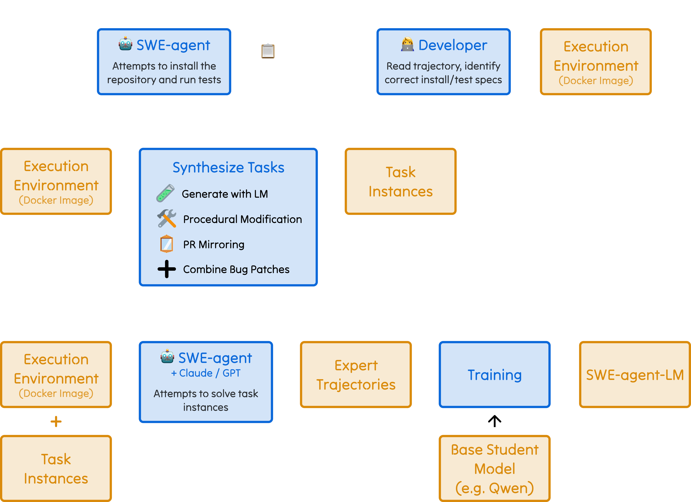

# SWE-smith

<div style="text-align:center">
  
</div>

SWE-smith is toolkit for training Software Engineering (SWE) agents. With SWE-smith, you can:

<div style="text-align:center">
  
</div>

Check out the [installation](installation.md) guide to get started, then head over to the [tutorials](../guides/index.md) to learn
about how to use SWE-smith.

If you use SWE-smith in your work, we'd greatly appreciate a citation:

```bibtex
@misc{yang2025swesmith,
  title={SWE-smith: Scaling Data for Software Engineering Agents}, 
  author={John Yang and Kilian Leret and Carlos E. Jimenez and Alexander Wettig and Kabir Khandpur and Yanzhe Zhang and Binyuan Hui and Ofir Press and Ludwig Schmidt and Diyi Yang},
  year={2025},
  eprint={2504.21798},
  archivePrefix={arXiv},
  primaryClass={cs.SE},
  url={https://arxiv.org/abs/2504.21798},
}
```
